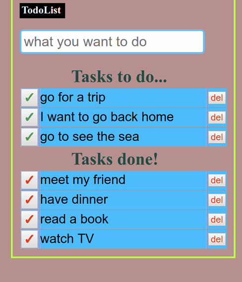
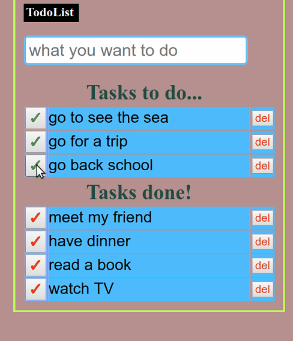
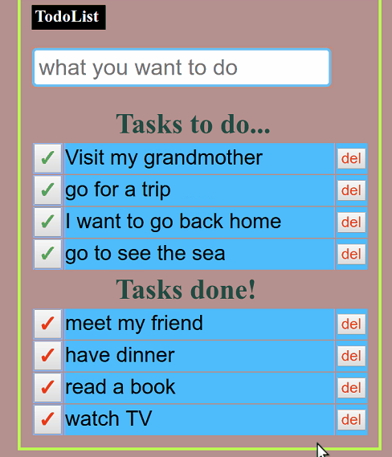

# TodoList

Introduce funtionalities as follow:

1. Add one todoItem

  

2. Change a todoItem's status as done
3. Undo a dotoItem's status as undo
 

 

4. Delete a dotoItem
 

 

5. Edit a todoItem
 

 

Major Tools used as follow:
  
  Backend:
    Django, RestFramework,
    
  Frontend:
    React, React-create-app, Axios.
